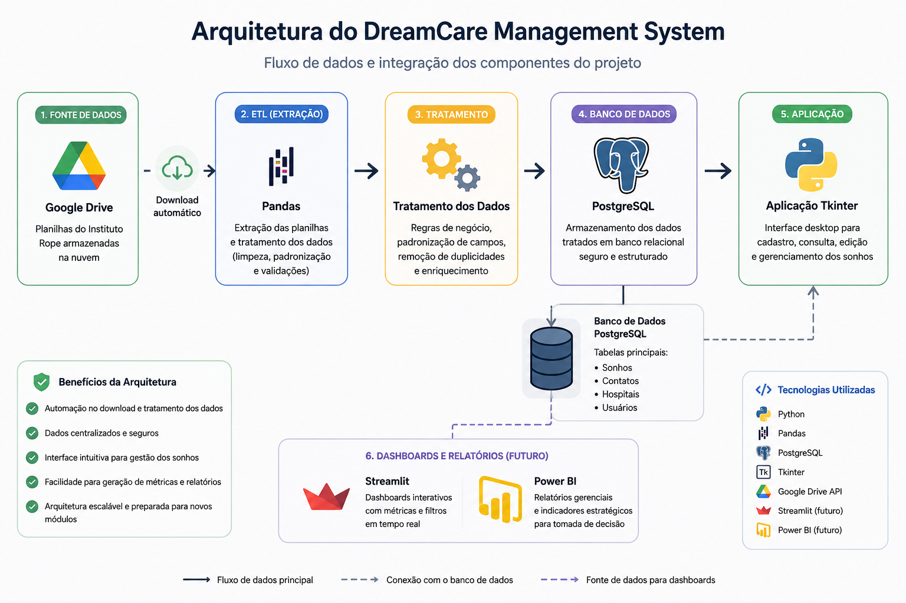
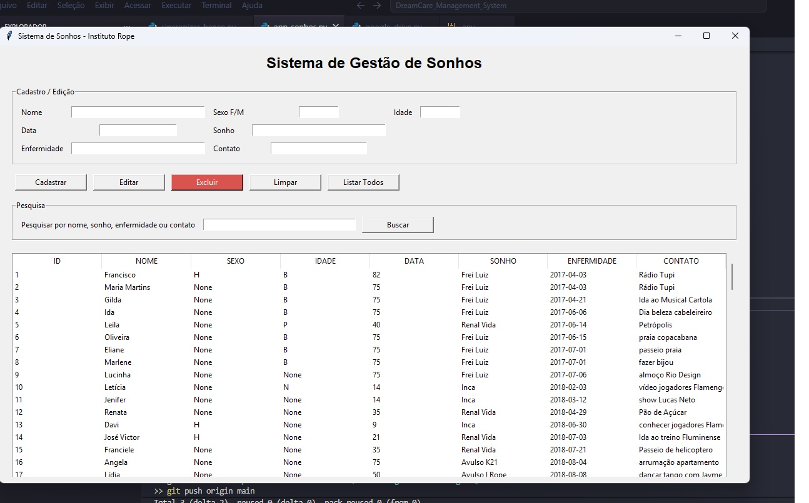
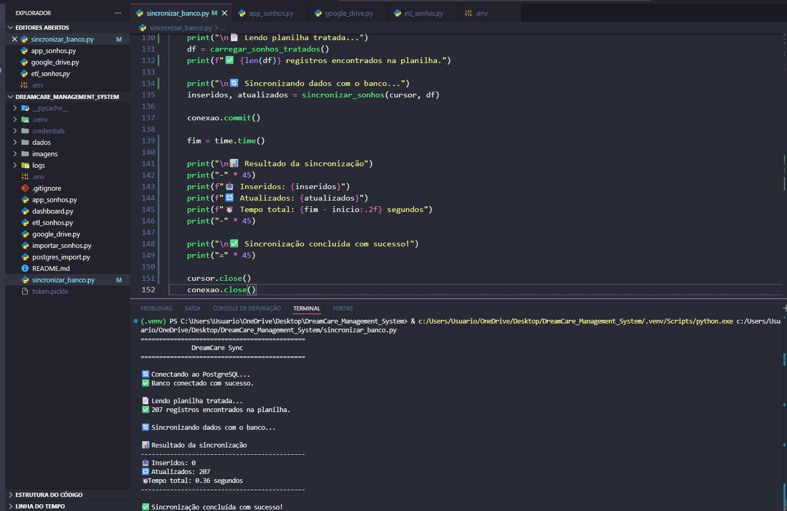
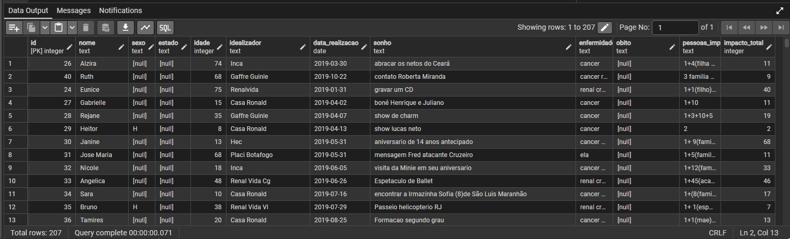

# 🏆 DreamCare Management System

<p align="center">
  
</p>

<p align="center">


</p>

<p align="center">
Sistema desenvolvido para automatizar o gerenciamento dos sonhos realizados pelo Instituto Rope, integrando ETL, PostgreSQL, Google Drive e uma interface desktop em Python.
</p>

---

# 📖 Sobre o Projeto

O **DreamCare Management System** nasceu para resolver um problema real: organizar e automatizar o gerenciamento dos sonhos realizados pelo Instituto Rope.

Anteriormente, todas as informações eram controladas manualmente em planilhas, tornando o processo demorado, sujeito a erros e difícil de consultar.

O sistema automatiza todo esse fluxo, desde o download da planilha no Google Drive até a sincronização com um banco PostgreSQL, oferecendo uma interface intuitiva para consulta e gerenciamento dos registros.

---

# 🎯 Objetivos

* Automatizar processos manuais
* Centralizar as informações dos sonhos
* Garantir integridade dos dados
* Facilitar consultas e atualizações
* Preparar a base para dashboards e análises

---

# 🚀 Principais Funcionalidades

* Download automático da planilha no Google Drive
* Processo ETL utilizando Pandas
* Limpeza e padronização dos dados
* Sincronização inteligente com PostgreSQL
* Inserção automática de novos registros
* Atualização automática de registros existentes
* Interface Desktop em Tkinter
* Cadastro de sonhos
* Pesquisa por registros
* Edição de informações
* Exclusão de registros
* Estrutura modular para facilitar manutenção

---

# 🏗 Arquitetura do Sistema

<p align="center">

</p>

---

# 🔄 Fluxo de Dados

```text
Google Drive
      │
      ▼
Download Automático
      │
      ▼
ETL (Pandas)
      │
      ▼
Tratamento dos Dados
      │
      ▼
PostgreSQL
      │
      ▼
Aplicação Desktop (Tkinter)
```

---

# 📸 Demonstração

## Interface Principal

<p align="center">

</p>

---

## Cadastro de Sonhos

<p align="center">

</p>

---

## Sincronização Automática

<p align="center">

</p>

---

## Banco PostgreSQL

<p align="center">

</p>

---

# 🛠 Tecnologias Utilizadas

* Python
* PostgreSQL
* Pandas
* Tkinter
* Google Drive API
* Psycopg2
* python-dotenv
* Git
* GitHub

---

# 📂 Estrutura do Projeto

```text
DreamCare_Management_System
│
├── app_sonhos.py
├── google_drive.py
├── etl_sonhos.py
├── sincronizar_banco.py
├── postgres_import.py
│
├── dados/
├── imagens/
├── logs/
├── credentials/
│
└── README.md
```

---

# ▶️ Como Executar

## Clone o repositório

```bash
git clone https://github.com/Terezafigueiredo/DreamCare_Management_System.git
```

## Instale as dependências

```bash
pip install -r requirements.txt
```

## Configure as variáveis de ambiente

Crie um arquivo `.env` com as credenciais do PostgreSQL.

Exemplo:

```env
DB_HOST=localhost
DB_NAME=projeto_rope
DB_USER=postgres
DB_PASSWORD=sua_senha
DB_PORT=5432
```

## Execute

```bash
python app_sonhos.py
```

---

# 📈 Próximas Implementações

* Dashboard em Streamlit
* Dashboard Power BI
* API REST
* Login de usuários
* Controle de permissões
* Relatórios em PDF
* Backup automático
* Deploy em nuvem

---

# 👩‍💻 Sobre a Desenvolvedora

**Tereza Cristina Silva Figueiredo**

Estudante de Análise e Desenvolvimento de Sistemas, apaixonada por desenvolvimento de software, banco de dados, automação e análise de dados.

Este projeto foi desenvolvido para aplicar conhecimentos em:

* Engenharia de Software
* Python
* ETL
* PostgreSQL
* Desktop Development
* Integração de Sistemas
* Organização de Projetos
* Versionamento com Git

---

# ⭐ Gostou do projeto?

Se este projeto foi útil ou interessante para você, deixe uma ⭐ no repositório.

Isso incentiva a continuidade do desenvolvimento e ajuda outras pessoas a encontrarem o projeto.

