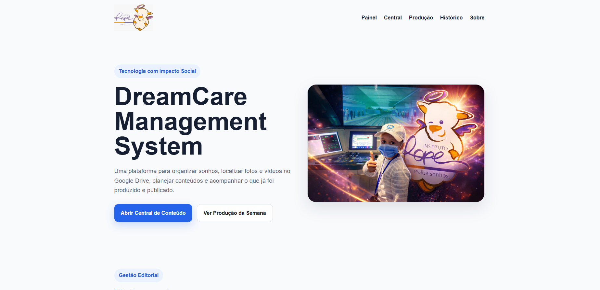
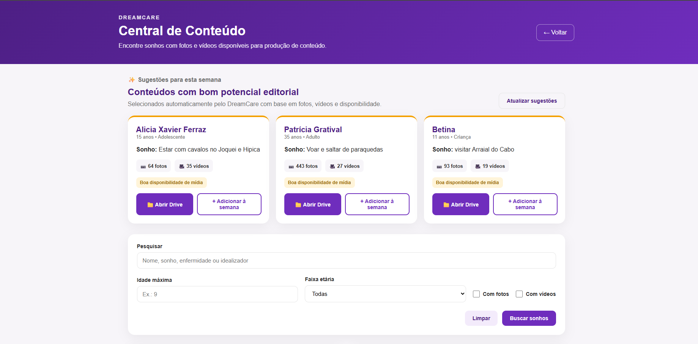
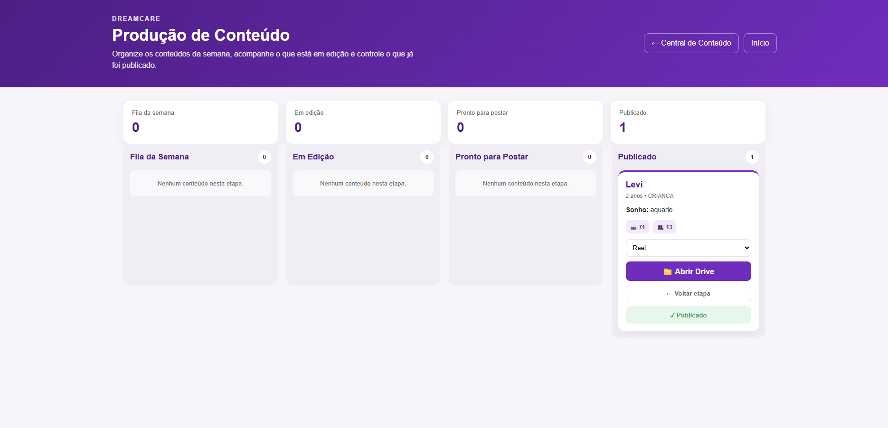
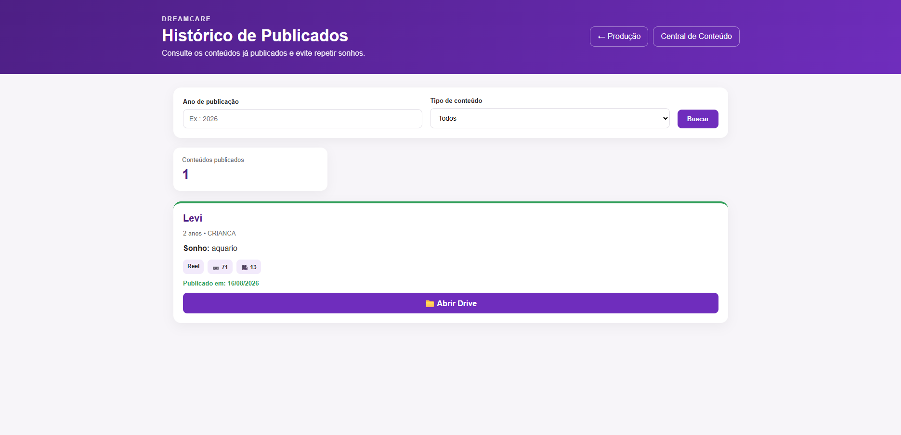
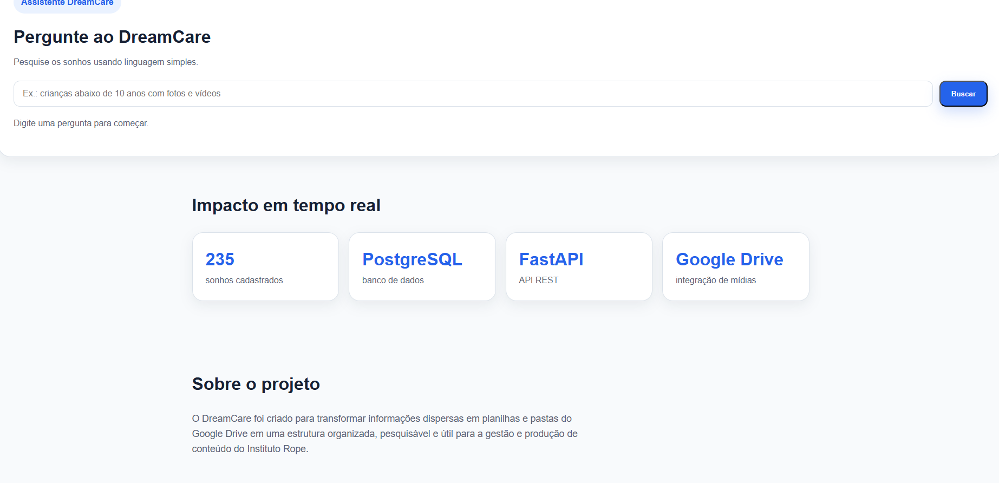

# 💜 DreamCare Management System

<p align="center">
  
</p>

<p align="center">


</p>

<p align="center">
Plataforma desenvolvida para organizar dados, localizar mídias, automatizar processos e apoiar a gestão editorial dos sonhos realizados pelo Instituto Rope.
</p>

---

# 📖 Sobre o projeto

O **DreamCare Management System** nasceu para solucionar um problema real do Instituto Rope.

As informações dos sonhos realizados eram mantidas principalmente em planilhas, enquanto fotos e vídeos estavam distribuídos em diferentes pastas do Google Drive.

Com o crescimento da base, localizar informações e mídias, acompanhar conteúdos produzidos e controlar publicações passou a exigir cada vez mais trabalho manual.

O DreamCare transforma esse processo em uma plataforma integrada, conectando **dados, automação, banco de dados, API, Google Drive e uma aplicação web voltada à gestão de conteúdo**.

---

# 🚀 Evolução do projeto

O DreamCare começou como um projeto de tratamento e organização de dados.

A primeira solução utilizava:

```text
Planilha
   ↓
Python + Pandas
   ↓
ETL
   ↓
PostgreSQL
   ↓
Interface Desktop com Tkinter
```

O desktop funcionou como MVP para validar o cadastro, consulta e gerenciamento dos registros.

Com a evolução das necessidades, a arquitetura foi ampliada:

```text
Google Drive
      ↓
ETL / Integração de Dados
      ↓
PostgreSQL
      ↓
FastAPI
      ↓
Aplicação Web
      ↓
Gestão Editorial
```

Hoje o DreamCare deixou de ser apenas uma aplicação de cadastro e passou a apoiar também o fluxo de produção de conteúdo.

---

# 🖥️ Painel DreamCare

A página inicial funciona como um painel central da aplicação.

Ela apresenta indicadores do fluxo editorial e permite acessar rapidamente:

- Central de Conteúdo
- Produção da Semana
- Sugestões da Semana
- Histórico de Publicações
- Assistente DreamCare
- Indicadores do projeto

Também exibe dados atualizados diretamente pela API.

<p align="center">
  
</p>

---

# 🔎 Central de Conteúdo

A Central de Conteúdo permite pesquisar os sonhos cadastrados e localizar rapidamente materiais disponíveis para produção.

É possível pesquisar utilizando:

- Nome
- Sonho
- Enfermidade
- Idealizador
- Idade máxima
- Faixa etária
- Disponibilidade de fotos
- Disponibilidade de vídeos

Os resultados são integrados às respectivas pastas do Google Drive.

<p align="center">
  
</p>

---

# ✨ Sugestões Editoriais

O sistema também analisa automaticamente a disponibilidade de mídias dos sonhos cadastrados.

Com base principalmente na quantidade de fotos, vídeos e disponibilidade do registro, o DreamCare apresenta sugestões de conteúdos com bom potencial editorial.

```text
Sonhos cadastrados
        ↓
Mídias disponíveis
        ↓
Análise dos registros
        ↓
Sugestões editoriais
        ↓
Produção da semana
```

A partir da própria sugestão é possível:

- consultar o sonho;
- visualizar a quantidade de mídias;
- abrir a pasta no Google Drive;
- adicionar o conteúdo à produção da semana.

---

# 🎬 Produção de Conteúdo

Os conteúdos selecionados entram em um fluxo visual de produção.

O processo é dividido em quatro etapas:

```text
Fila da Semana
      ↓
Em Edição
      ↓
Pronto para Postar
      ↓
Publicado
```

Cada conteúdo pode receber um formato editorial:

- Reel
- Carrossel
- Story
- Post

O usuário também pode acessar diretamente as mídias no Google Drive e avançar ou retornar o conteúdo entre as etapas.

<p align="center">
  
</p>

---

# ✅ Histórico de Publicações

Ao finalizar uma produção, o conteúdo passa a integrar automaticamente o histórico.

O histórico registra informações como:

- sonho;
- pessoa atendida;
- tipo de conteúdo;
- quantidade de mídias;
- data de publicação;
- pasta correspondente no Google Drive.

Também é possível pesquisar por **ano de publicação** e **tipo de conteúdo**.

Isso ajuda a equipe a consultar conteúdos anteriores e evitar repetição de sonhos nas publicações.

<p align="center">
  
</p>

---

# 💬 Assistente DreamCare

O projeto também possui uma interface de consulta utilizando linguagem simples.

Em vez de depender apenas dos filtros tradicionais, o usuário pode escrever consultas como:

```text
crianças abaixo de 10 anos com fotos e vídeos
```

A aplicação interpreta a solicitação e utiliza os dados disponíveis para localizar registros compatíveis.

Essa funcionalidade representa a evolução do projeto em direção a interfaces mais intuitivas para consulta de dados.

<p align="center">
  
</p>

---

# 📊 Impacto em tempo real

A aplicação consulta a API para apresentar informações atualizadas sobre a base.

Atualmente, a arquitetura integra:

- PostgreSQL para armazenamento estruturado;
- FastAPI para disponibilização dos dados;
- Google Drive para localização das mídias;
- aplicação web para interação com os usuários.

Os indicadores não precisam ser mantidos manualmente na interface.

---

# 🏗️ Arquitetura

```text
                 GOOGLE DRIVE
                      │
                Fotos e vídeos
                      │
                      ▼
             Integração de mídias
                      │
                      ▼
PLANILHAS ─────► ETL Python/Pandas
                      │
                      ▼
                 PostgreSQL
                      │
                      ▼
                   FastAPI
                      │
                      ▼
                Aplicação Web
                      │
        ┌─────────────┼──────────────┐
        │             │              │
        ▼             ▼              ▼
     Central       Produção      Histórico
        │
        ▼
   Sugestões
   Editoriais
        │
        ▼
   Assistente
   DreamCare
```

---

# 🛠️ Tecnologias

### Backend

- Python 3.12
- FastAPI
- PostgreSQL
- Psycopg2
- python-dotenv

### Dados

- Pandas
- ETL
- SQL

### Integrações

- Google Drive API

### Frontend

- HTML5
- CSS3
- JavaScript

### MVP inicial

- Tkinter

### Desenvolvimento

- Git
- GitHub
- VS Code

---

# 🧠 Conceitos aplicados

O projeto aplica conceitos de:

- Engenharia de Software
- Desenvolvimento Backend
- Desenvolvimento Web
- APIs REST
- Banco de Dados Relacional
- SQL
- ETL
- Automação de Processos
- Integração de Sistemas
- Manipulação de Dados
- Regras de Negócio
- Versionamento de Código
- Desenvolvimento orientado a problemas reais

---

# 📂 Estrutura

```text
DreamCare_Management_System/
│
├── api/
│   └── main.py
│
├── desktop/
│   └── app_sonhos.py
│
├── landing/
│   ├── assets/
│   ├── index.html
│   ├── style.css
│   ├── script.js
│   ├── central.html
│   ├── central.css
│   ├── central.js
│   ├── producao.html
│   ├── producao.css
│   ├── producao.js
│   ├── historico.html
│   ├── historico.css
│   └── historico.js
│
├── imagens/
│
├── google_drive.py
├── etl_sonhos.py
├── sincronizar_banco.py
├── vincular_drive.py
├── requirements.txt
├── .env.example
├── .gitignore
└── README.md
```

---

# 🔐 Segurança e privacidade

Credenciais e informações sensíveis não devem ser armazenadas no repositório.

O projeto utiliza `.gitignore` para impedir o versionamento de arquivos como:

```text
.env
credentials/
token.json
token.pickle
*.xlsx
*.db
.venv/
__pycache__/
```

O arquivo `.env.example` possui apenas valores demonstrativos:

```env
DB_HOST=localhost
DB_NAME=projeto_rope
DB_USER=postgres
DB_PASSWORD=sua_senha
DB_PORT=5432
```

> Dados reais utilizados pelo Instituto Rope não fazem parte do repositório público.

---

# ⚙️ Executando o projeto

## Clone o repositório

```bash
git clone https://github.com/Terezafigueiredo/DreamCare_Management_System.git
```

Entre na pasta:

```bash
cd DreamCare_Management_System
```

Crie o ambiente virtual:

```bash
python -m venv .venv
```

No Windows:

```bash
.venv\Scripts\activate
```

Instale as dependências:

```bash
pip install -r requirements.txt
```

Configure o arquivo `.env` com base no `.env.example`.

---

# 🚀 Executando a API

```bash
uvicorn api.main:app --reload
```

Durante o desenvolvimento, a API é executada localmente e disponibiliza os endpoints utilizados pela interface web.

---

# 🌐 Executando o Frontend

Durante o desenvolvimento local, a pasta `landing` pode ser executada através do **Live Server** no VS Code.

A interface consome os dados disponibilizados pela API FastAPI.

---

# 📈 Status do projeto

### MVP funcional em evolução

- [x] ETL com Python e Pandas
- [x] PostgreSQL
- [x] MVP desktop com Tkinter
- [x] Integração com Google Drive
- [x] Mapeamento de fotos e vídeos
- [x] API REST com FastAPI
- [x] Interface web
- [x] Painel principal
- [x] Central de Conteúdo
- [x] Pesquisa e filtros
- [x] Sugestões editoriais
- [x] Produção da Semana
- [x] Fluxo de produção
- [x] Tipos de conteúdo
- [x] Histórico de publicações
- [x] Assistente de consulta em linguagem simples

---

# 🔮 Próximas evoluções

- [ ] Autenticação
- [ ] Controle de usuários e permissões
- [ ] Proteção de endpoints privados
- [ ] Deploy do backend
- [ ] Dashboard com novos indicadores
- [ ] Métricas editoriais
- [ ] Testes automatizados
- [ ] Logs e monitoramento
- [ ] Melhorias contínuas de acessibilidade
- [ ] Expansão do Assistente DreamCare
- [ ] Novas automações para apoio à produção

---

# 👩‍💻 Desenvolvedora

**Tereza Cristina Silva Figueiredo**

Estudante de **Análise e Desenvolvimento de Sistemas**.

O DreamCare foi desenvolvido a partir da identificação de um problema real e evolui conforme novas necessidades são observadas durante sua utilização.

O projeto reúne conhecimentos de desenvolvimento de software, dados, automação, banco de dados e integração de sistemas.

---

# 💜 Tecnologia com impacto social

O DreamCare demonstra como uma solução pode evoluir de uma planilha e um processo manual para uma arquitetura integrada de dados e software.

Mais do que organizar registros, o objetivo é utilizar tecnologia para facilitar o trabalho de quem transforma sonhos em realidade.